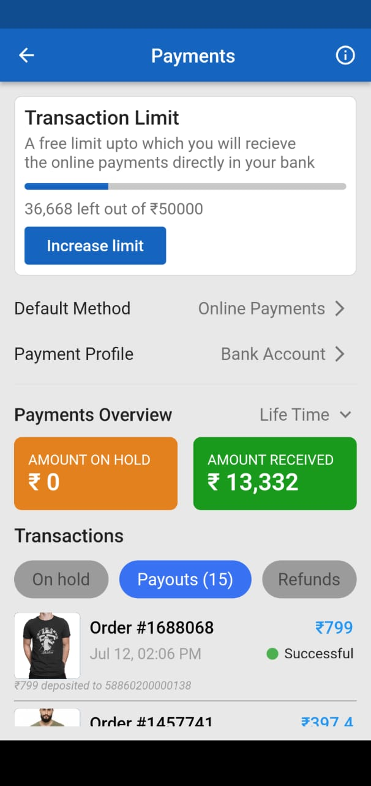
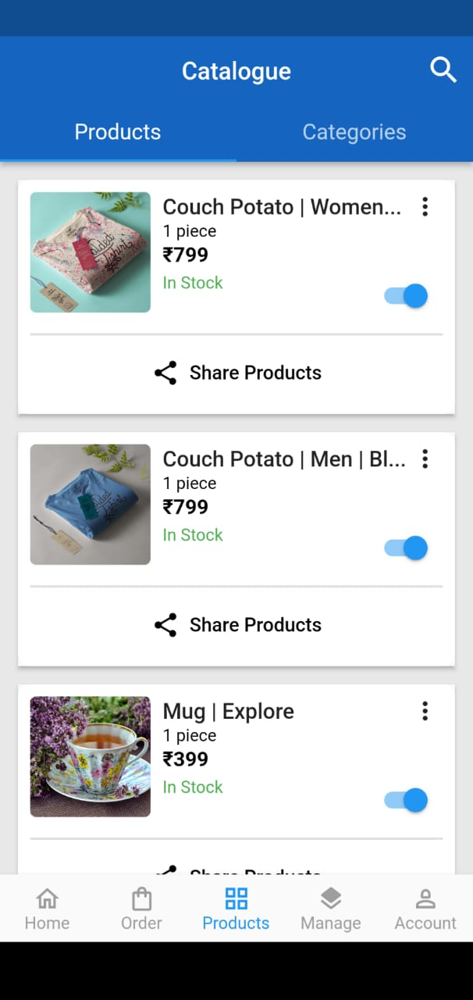

# Dukaan App Clone

This repository contains a clone of the Dukaan app built using Flutter. The app is a mobile e-commerce platform that allows users to manage their stores, view payment history, and access order details, among other features.

## Features Implemented

- Catalogue Page: The app includes a catalogue page that displays various products available for sale. The page utilizes tab bar navigation to categorize products effectively.

- Dukaan Premium: Users can access the premium features of Dukaan, which may include additional functionalities and benefits.

- Bottom Navigation: The app incorporates a bottom navigation bar that allows users to switch between different sections of the app effortlessly.

- Manage Store Page: Users have the ability to manage their stores through a dedicated page. This feature enables them to add, update, or remove products and perform other store-related tasks.

- Payment History Page: The app includes a payment history page that allows users to view their past transactions and track their payment records.

- Order Details Page: Users can access the details of their individual orders through a dedicated page. This feature provides users with information such as order status, items purchased, and delivery details.

## Screenshorts






## Future Updates

- User Authentication: Implement user authentication functionality to allow users to create accounts, log in, and manage their profiles.

- Cart Functionality: Develop a shopping cart feature that enables users to add products to their cart, view the cart, and proceed to checkout.

- Search Functionality: Implement a search feature that allows users to search for products by name or category.

- Push Notifications: Integrate push notification support to keep users informed about order updates, promotions, and other relevant information.

- Ratings and Reviews: Add the ability for users to rate and review products, providing valuable feedback to store owners and other customers.

- Order Tracking: Implement order tracking functionality to enable users to track the status of their orders in real-time.

- Social Media Integration: Allow users to share products or their store on social media platforms to increase visibility and reach.

- Internationalization (i18n): Support multiple languages to cater to users from different regions.

Please note that this list is not exhaustive, and additional features and improvements may be added based on the development progress and user feedback.

## Usage

To run the Dukaan app clone on your local machine, follow these steps:

1. Ensure you have Flutter and its dependencies installed on your system.

2. Clone this repository using the following command:
   ```
   git clone https://github.com/joyaljosephnote/dukaan-app-clone.git
   ```

3. Navigate to the project directory:
   ```
   cd dukaan-app-clone
   ```

4. Run the app using the following command:
   ```
   flutter run
   ```

## Contribution

Contributions to enhance the Dukaan app clone are welcome. If you would like to contribute, please follow these steps:

1. Fork the repository.

2. Create a new branch for your feature or bug fix:
   ```
   git checkout -b feature/your-feature-name
   ```

3. Make the necessary changes and commit them:
   ```
   git commit -m "Add your commit message"
   ```

4. Push your changes to the branch:
   ```
   git push origin feature/your-feature-name
   ```

5. Open a pull request on the original repository and provide a detailed description of your changes.


## Contact

If you have any questions or feedback regarding the Student Registration App, please feel free to reach out to us at hellotechmalayalam@gmail.com. We value your input and would be happy to assist you.

Let's simplify student registration together with the Student Registration App! 🎓📝